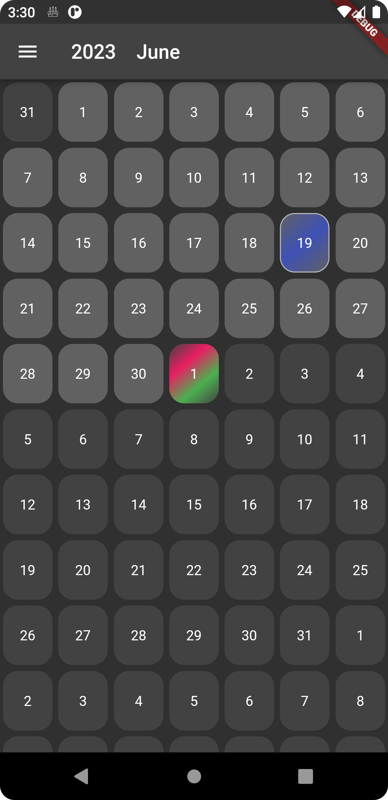
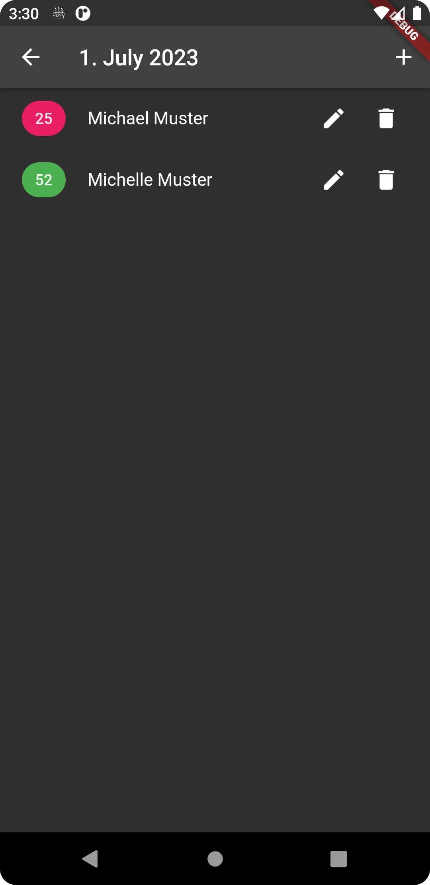
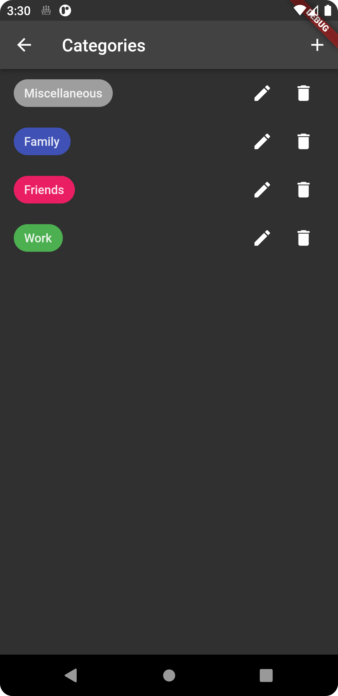
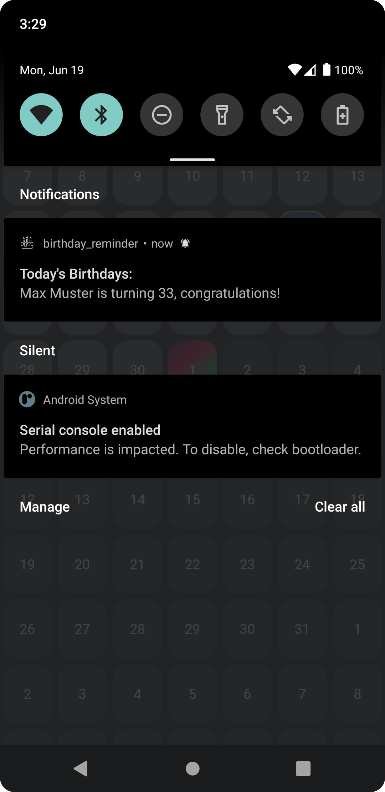

# birthday_reminder

A simple app written with Flutter that helps users keep track of birthdays. Birthdays can be associated with user-defined categories to ease managing them. A notification is sent every day informing the user of today's birthdays.

    
    
    
    

